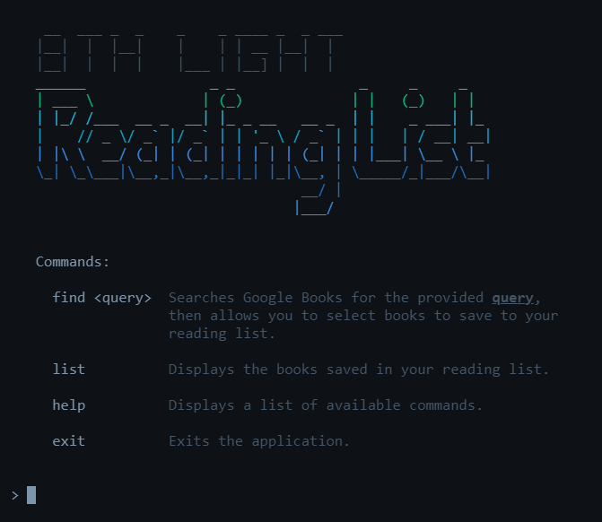
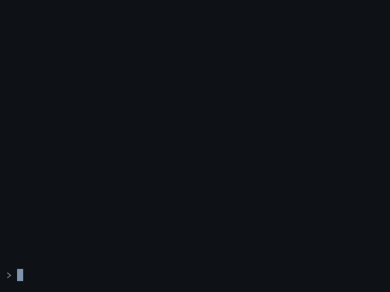

&nbsp; 
<h1 align="center"> 
  
</h1>

&nbsp;  
<!--###-->
#  Meta  #
<!--###-->

### [Project Information](./__Documentation__/Documents/ProjectInfo/__Main__.md) #

&nbsp;  
<!--##############-->
#  Getting Started  #
<!--##############-->

### Method 1
<!---->
- download the [**Latest Release**](../../releases/latest)
- run the executable file
<!---->

### Method 2
<!---->
- install [**Node.js**](https://nodejs.org/en/download)
- clone or [**download**](../../archive/master.zip) this repo
- open your local repo directory in a command line interface and execute the following commands:
  - `npm install --quiet`
  - `npm start`
<!---->

&nbsp;  
<!--####-->
#  Usage   #
<!--####-->

<table>
<tr>

  <td>
  <h2><code>find &ltquery&gt</code></h2>
  
Searches <b><a href="https://books.google.com">Google Books</a></b> for the provided <code>query</code>, then allows you to select books to save to a reading list.

  </td>

  <td width="500"></td>
  
</tr>
<tr>

  <td>
  <h2><code>list</code></h2>
  
Displays the books saved in your reading list.

  </td>

  <td width="500"></td>
  
</tr>
</table>
